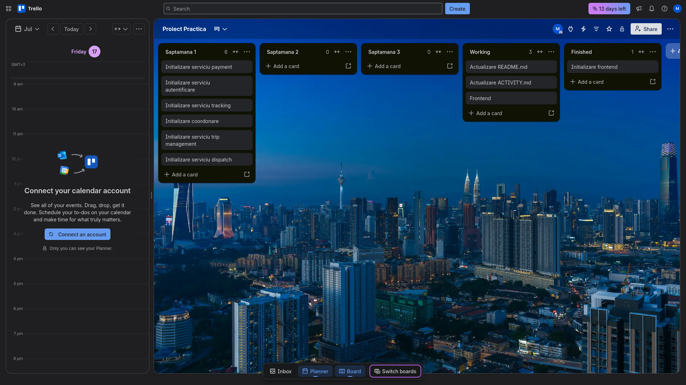

# Ziua 1
- Creat Trello board: 
- Creat pagina de github: https://github.com/Madolchy/GOTO_proiect_practica
- Creat template pentru frontend, folosind svelte 5

# Ziua 2
- Frontend
    - Adaugat cerere de permisiune pentru geolocatia pentru a afla locatia exacta a utilizatorului
    - Adaugat logica de waypoint, punct de incepere si ajungere
    - La 2 puncte alese, se deschide un modal care trimite cerere de calculare a pretului si gasire sofer
- Serviciu Dispatch:
    - Analizat posibilitati de stack pentru backend
    - Adaugat librarie de grpc prin connectrpc pentru comunicare client-server prin grpc

# Ziua 3
- Serviciu Price:
    - Initializat proiect
    - Adaugat logica de calculare pret bazat pe distanta
- Frontend
    - Modificat sa fie compatibil obiectul cu backend
    - Adaugat logica de disable pana cand se raspunde cu pretul din backend
- FrontendDriver
    - Initializat o aplicatie in sine pentru soferi
    - Copiat frontend initial, modificat sa poata fi adaugata positia + setat pentru connectrpc
- Modificat repo-ul sa fie monorepo.
- Adaugat fisier proto pentru comunicare grpc

# Ziua 4
- FrontendDriver:
    - Creat logica de rpc pentru driver client
    - Adaugat buton pentru a marca ca soferul este activ
- Dispatcher:
    - Creat logica de rpc pentru driver
- Realizat cu succes comunicare intre frontend si backend
- Inceput diagrama arhitecturala
