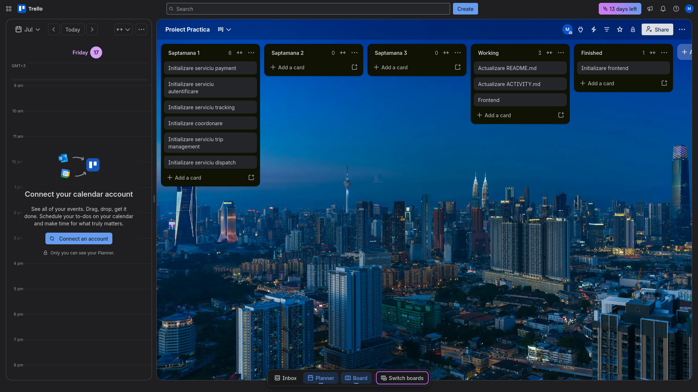

# Ziua 1
- Creat Trello board: 
- Creat pagina de github: https://github.com/Madolchy/GOTO_proiect_practica
- Creat template pentru frontend, folosind svelte 5

# Ziua 2
- Frontend
    - Adaugat cerere de permisiune pentru geolocatia pentru a afla locatia exacta a utilizatorului
    - Adaugat logica de waypoint, punct de incepere si ajungere
    - La 2 puncte alese, se deschide un modal care trimite cerere de calculare a pretului si gasire sofer
- Serviciu Dispatch:
    - Analizat posibilitati de stack pentru backend
    - Adaugat librarie de grpc prin connectrpc pentru comunicare client-server prin grpc

# Ziua 3
- Serviciu Price:
    - Initializat proiect
    - Adaugat logica de calculare pret bazat pe distanta
- Frontend
    - Modificat sa fie compatibil obiectul cu backend
    - Adaugat logica de disable pana cand se raspunde cu pretul din backend
- FrontendDriver
    - Initializat o aplicatie in sine pentru soferi
    - Copiat frontend initial, modificat sa poata fi adaugata positia + setat pentru connectrpc
- Modificat repo-ul sa fie monorepo.
- Adaugat fisier proto pentru comunicare grpc

# Ziua 4
- FrontendDriver:
    - Creat logica de rpc pentru driver client
    - Adaugat buton pentru a marca ca soferul este activ
- Dispatcher:
    - Creat logica de rpc pentru driver
- Realizat cu succes comunicare intre frontend si backend
- Inceput diagrama arhitecturala

# Ziua 5
- Coordonator:
    - Initializat serviciu pentru coordonare
    - Adaugat comunicare prin rpc intre microservici
- Price
    - Adaugat comunicare prin rpc intre microservici
- Frontend:
    - Toate cererile o sa treaca prin coordonator
    
# Ziua 6
- Revizuit planul de arhitectura, am decis ca inloc de kafka (care e overkill) pentru proiect o sa raman la:
    - RabbitMQ pentru comunicare asincrona
    - pg-boss pentru cron jobs
- Adaugat rabbitmq pentru comunicare async intre backend
- Decis de a merge pe arhitectura orchestrata in care coordonatorul este 'central brain'
- Adaugat docker-compose pentru rabbitmq
- Dispatch
    - Implementat metoda de comunicare prin rabbitmq
- Coordonator
    - Implementat metoda de comuunicare prin rabbitmq
- Stabilire canale de queue pentru amandoua + testare setare

# Ziua 7
- Adaugat suport pentru websocket in dispatch
- Frontend
    - Adaugat mutate pentru a cere un ride id si pentru a incepe side-effectul de cautare unui ride
- FrontendDriver
    - Adaugat logica de websocket pentru comunicarea cu dispatch
- Dispatch
    - Adaugat logica de websocket pentru comunicare cu frontendDriver
- Coordonator
    - Organizat folderele dupa nume, incat endpointul de dispatch foloseste mai multe protocoale de comunicare
    - Adaugat comunicare prin SSE
- Analiza arhitecturala + aflarea limitatilor de streaming prin connect rpc si browsere

# Ziua 8
- Probleme cu configurare websocket in majoritatea zilei...
- Frontend
    - Reparat url broken pentru SSE
    - Modificat Modal sa arete ce sofer a aceptat cursa
    - Reparat url pentru websocket, incat socket.io foloseste http nu ws / wss direct si face upgrade dupa.
- Dispatch
    - Adaugat comunicarea de raspundere pentru coordonator in caz de cursa aceptata
    - Reparat un bug in care EventPattern nu era inregistrat daca nu modulul nu are controller + mutat din Service in controller logica de redis si creat functie de serviciu pentru comunicare in sine
    - Adaugat logica de a gasi cel mai bun sofer pentru oferat (closest to origin)
- FrontendDriver
    - Adaugat streaming with websocket catre dispatch
    - Creat Modal pentru a avertiza cand primeste o oferta cu buton de apceptare / respingere
- Coordinator
    - Am decis sa raman la arhitectura de pub/sub de redisp entru a putea avea mai multe instante active.
    - (Ramane de schimbat din memory map in redis kyv)

# Ziua 10
- Migrat la o versiune mai noua de rabbitmq incat are optiunea de retry la mesaje rejected
- Reparat niste exchange-key-uri din rabbitmq care erau gresite (si crea load balancing intre 2 instance ne legate)

# Ziua 11
- Frontend:
    - Continuat cu organizarea logici si curatarea codului, separat logica de business din .svelte pe cat posibil
    - Adaugat driver icon pentru a afisa pozitia soferilor + date de test temporare
- Coordonator:
    - Adaugat redis pentru pub/sub intre mai multe instances
    - Reparat o eroare de routing-key pentru failure
    - Creat modul de redis pentru initializare
    - Modificat main.ts pentru a suporta redis si toate modificarile
- Dispatch:
    - Majoritatea a fost schimbat asemanator cu coordinator, adaugat redis etc...
    
Ziua 12:
Frontend:
    - Adaugat SSE intr-un store personal, folosind event-driven pentru a decupla logica intre stores.
    - Creat store pentru ride / driver personali.
    - Adaugat type.ts pentru tipuri, incluzand endpoint-urile din SSE care primesc mesaj
FrontendDriver:
    - Urmat o logiuca similara cu frontend pentru event-driver, doar ca folosind websocket inloc de SSE
    - Creat un map pentru fiecare state de butoane, incat chain de if-else e urat
Coordonator:
    - O majoritate de logica a fost in controller, asa ca am organizat la locul lor in service
    - Update la rabbitmq pentru a folosi o versiune noua care suporta retry on error
    - Folosirea de lock pentru soferi prin redis, pentru a ajunge la idempotenta si a preveni coruptia datelor

Ziua 13:
Frontend:
    - Adaugat pas de "DriverFound" in care se va afisa informatii despre cursa si de asteptare
    - Separat logica repetata intr-un folder numit utils, in special pentru markere
- Dispatch:
    - Adaugat postgre dar nu iutilizat inca
    - Adaugat drizzle pentru orm
